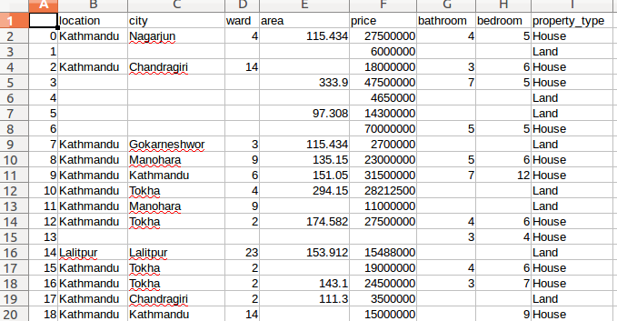
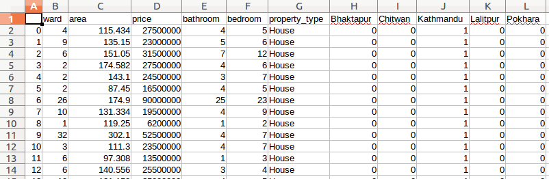
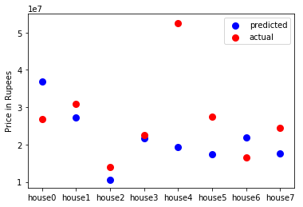

# Real state price predictor for Nepal 

## Objective
The objective of this project is to make a simple real estate price predictor for Nepal.

## Introduction
The price of real state depends on location and features of the property such as number of bedrooms in the case of house. In this project, location and other features of properties put on sale is extracted from the web using python library Beautifulsoup. Further refinining of the data is done by crateing a pipeline and at the end data in .csv formatt is obtained. Different data analysis libraries and regular expression engine in python is used to do the necessary data cleaning and feature engineering. 

The data is then split into train and test data. After that the data is fed into the prediction model. Finally, model is tested by test data and accuracy of the model is calcuated.

## Details

The detailed process is presented in steps as follows;

<b>* Step 1: Data is scraped from the web using beautifulsoup library in python. </b>

Html is parsed and real state data is obtained by looping through the the "div" and "class" where the data is present. Same process is repeated for several html files in order to obtain more data.

```python
from bs4 import BeautifulSoup


def get_data(url):
    """Returns scrapped real state data from html file"""

    url = open(url)
    soup = BeautifulSoup(url, 'html.parser')
    soup = soup.find_all(
        "div: div which contains data", {"class": "class which contains data"})
    soup = soup[0].find_all('div', {"class": "data item"})
    for item in soup:
        data = {}
        data["title"] = item.div.a.get('title')
        data["location"] = item.find(
            'div', {"class": "wpl_prp_listing_location"}).get_text()
        data["price"] = item.find(
            'div', {'class': 'price_box'}).span.get('content')
        bedroom = item.find('div', {'class': 'bedroom'})
        if bedroom == None:
            data["bedroom"] = None
        else:
            data["bedroom"] = bedroom.find(
                'span', {'class': 'value'}).get_text()
        bathroom = item.find('div', {'class': 'bathroom'})
        if bathroom == None:
            data["bathroom"] = None
        else:
            data["bathroom"] = bathroom.find(
                'span', {'class': 'value'}).get_text()
        area = item.find('div', {'class': 'built_up_area'})
        if area == None:
            data["area"] = None
        else:
            data["area"] = area.get_text()

        all_data.append(data)
    return all_data


if __name__ == "__main__":
    import json

    urls = ['url1.html','url2.html','url3.html','url4.html','url5.html','url6.html','url7.html',...............]
    
    all_data = []
    for url in urls:
        get_data(url)
    
    with open('data.json','w') as outfile:
        json.dump(all_data, outfile)

```
  The scraped raw data is stored as a .json file.

  <b> * Step 2: Data is refined using pands, regex and feature engineering is performed.</b>

Price, area, location, and other features of the real state property is extracted using regex and necessary modification is performed to make data consitant. For example, there were different types of unit are used for area and using same_unit fuction. All of the property area is converted into meter square.

```python
import pandas as pd 

data = pd.read_json('data.json')


price = data['price'].str.extract(r'(?P<price>\d+,\d+,\d+)')


price['price'] = price['price'].str.replace(',','')

area = data['area'].str.extract(r'(?P<area>\d+?.\d+)(?P<area_unit>[a-zA-Z]+)')

location = data['location'].str.extract(r'(?P<city>\w+).?-.?(?P<ward>\d+),.(?P<location>\w+)')

refined_data = pd.DataFrame()

refined_data['location'] = location['location']

refined_data['city'] = location['city']

refined_data['ward'] = location['ward']

refined_data['area'] = area['area']

refined_data['area_unit'] = area['area_unit']

refined_data['price'] = price['price']

refined_data['bathroom'] = data['bathroom']

refined_data['bedroom'] = data['bedroom']

refined_data['area'] = refined_data['area'].str.replace(',','')

def title(x):
    house_words = ['Home','House']
    land_words = ['Land','land']
    house = any(word in x for word in house_words)
    land = any(word in x for word in land_words)
    if house:
        return "House"
    elif land:
        return "Land"
    else:
        return "other"
 
property_type = data['title'].apply(title)
refined_data['property_type'] = property_type

refined_data['area_unit'].unique()

def same_unit(x):
    if x['area_unit'] == 'Dhur':
        x['area'] = float(x['area'])*16.93
    elif x['area_unit'] == 'AAna':
        x['area'] = float(x['area'])*31.80
    elif x['area_unit'] == 'Ropani':
        x['area'] = float(x['area'])*508.72
    elif x['area_unit'] == 'kaththa':
        x['area'] = float(x['area'])*338.63
    elif x['area_unit'] == 'bigha':
        x['area'] = float(x['area'])*6772.63
    elif x['area_unit'] == 'Sqft':
        x['area'] = float(x['area'])*0.09290304
    else:
        x['area'] = None
    return x['area']


refined_data['area'] = refined_data[['area','area_unit']].apply(same_unit,axis=1)

refined_data.drop('area_unit', axis=1, inplace=True)
refined_data.to_csv('refined_data.csv')
```

The output is saved as .csv data. Now, the data looks much better. However, data needs more cleaning and feature engineering before feding into predicton model.


<b> * More data cleaning and feature engineering.</b>

NA values are dropped from the data set and resuling data is saved as dropna.csv.

```
import pandas as pd
data = pd.read_csv('refined_data.csv')
data = data.dropna().reset_index().drop(['index','Unnamed: 0','city'],axis=1)
data.to_csv('dropna.csv')
```
Coverting the location from categorial data to numeric data using get_dummies function of pandas.

```
data = data.join(pd.get_dummies(data['location'])).drop('location',axis=1)
```
At this point data looks like below;


Now, the data can be used in the prediction model.

<b>* Prediction model</b>

First of all data is split into train and test datasets.

```python
from sklearn.model_selection import train_test_split
X_train,X_test,y_train,y_test = train_test_split(data.drop('price',axis=1),data['price'],test_size=0.1)
```
Model initialization, fitting and prediction.

```python
from sklearn.linear_model import LinearRegression
model = LinearRegression()
model.fit(X_train,y_train)
y_predicted = model.predict(X_test)
```

Evaluating the model fit by mean square error, coefficient of determination ($r^2 score$) and plot.

```python
from sklearn.metrics import mean_absolute_error,r2_score
mean_absolute_error(y_test,y_predicted)
r2_score(y_test,y_predicted)
```
plotting the predicted and actual price of houses.

```python
import matplotlib.pyplot as plt
houses = range(len(y_test))
houses = ['house'+str(n) for n in houses]
plt.scatter(houses,y_predicted,color='blue',linewidth = 3,label='predicted')
plt.scatter(houses,y_test,color='red',linewidth=3,label='actual')
plt.ylabel('Price in Rupees')
plt.legend()
```


## Future work.
* Deploy the model.
